# 如何建立自己的個人網站和學術部落格 - 使用 GitHub Pages 靜態部署

# 1. 什麼是個人網站和學術部落格？

在本教學中，我們將跑通一個完整的閉環：**從找到一個現成的網站模板，到將其改造成馬斯克的個人主頁，最後免費發佈到網路上**。

學習本教學，你至少需要準備：

* **一台電腦**（Windows 或 Mac）
* **你的 GitHub 帳號**（用來儲存網站程式碼和提供免費託管）
* **已安裝 Trae**（你的 AI 程式設計夥伴）
* **Git 環境**
* **Ruby 環境**

## 1.1 什麼是學術個人主頁？

**學術個人主頁**是你在網際網路上的私人領地。

不同於微信朋友圈、知乎或 LinkedIn，它不依賴任何平台的推薦演算法，也不會因為平台關閉而消失。它是一個長期、穩定的**個人展示空間**，可以被 Google 和 Google Scholar 索引。通常包含你的簡介、發表論文、專案和技術部落格。

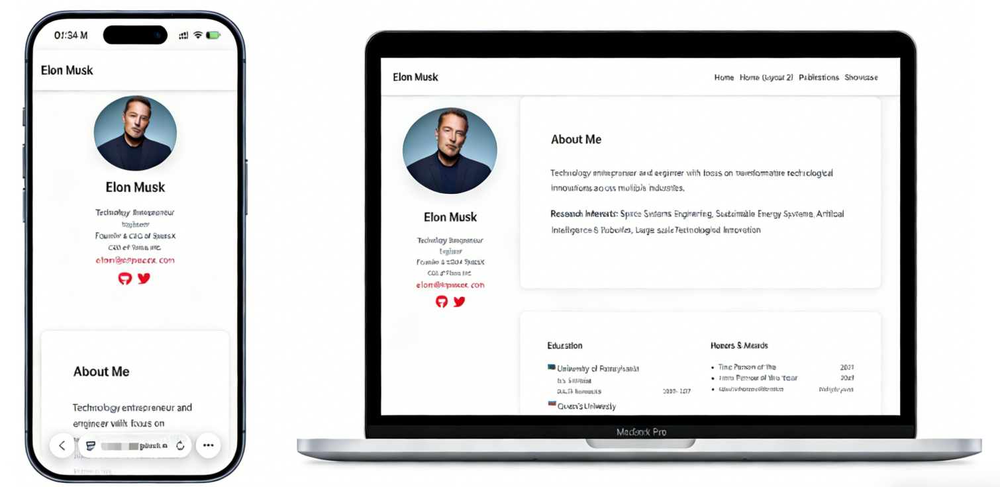

## 1.2 為什麼要建立自己的網站？

在 Vibe Coding 開發模式下，我們不再需要像十年前那樣啃厚厚的 HTML/CSS 書。有了 AI，建構網站的角色從「苦逼程式設計師」變成了「網站總編輯」：

1. **你（編輯 / PM）**：決定網站的調性和內容。例如：「把馬斯克的火星殖民 PPT 放在這裡」，或「把這個按鈕改成特斯拉紅」。
2. **Trae（AI 工程師）**：負責搞定硬核的實作工作。它把你的自然語言指令變成程式碼，包括版面配置、配色方案和手機端適配。
3. **GitHub Pages（展示廳）**：提供免費的伺服器和網域名稱，讓全世界的人都能看到你的作品。

**為什麼對學術或技術人員來說值得擁有？**

* **對外（建立影響力）**：它是一張**「常青名片」**。在申請博士班、找工作或合作時，一個整潔的個人主頁往往比 PDF 簡歷更有說服力。
* **對內（知識積累）**：它是你的**「第二大腦」**。你可以用它記錄課程筆記、技術思考，建立自己的知識體系。
* **面向未來（被發現）**：搜尋引擎喜歡結構化內容。有了主頁，當人們搜尋你的名字時，**你自己定義的內容**可以排在前面，而不是不相關的同名人士。

## 1.3 建構個人網站的四種典型方式

在實踐中，建構網站的方式有無數種。這裡我們只介紹四種最主流的：

**方式一：使用 HTML / CSS / JS 從零手寫**
這是傳統的資工路線。你一個字元一個字元地寫程式碼。優點是極致的靈活性。缺點是入門門檻非常高，而且容易在調 CSS 時卡住。對於我們這些想專注內容的人來說不太理想。

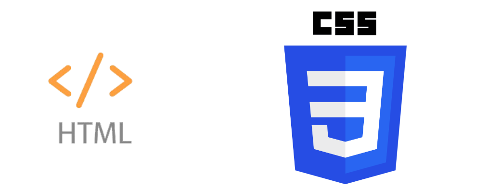

**方式二：視覺化建站工具如 Wix / WordPress**
這就像搭積木一樣。優點是簡單的拖拽編輯。缺點是通常需要付費，容易產生臃腫的程式碼，缺乏學術極客感，而且難以深度定制。


**方式三：基於 GitHub 的模板（靜態網站生成器）**
這是學術和極客社群中**最推薦**的主流路線。我們直接 fork 別人寫好的成熟模板（如基於 Jekyll 或 Hugo 的模板），然後只修改設定檔和內容。

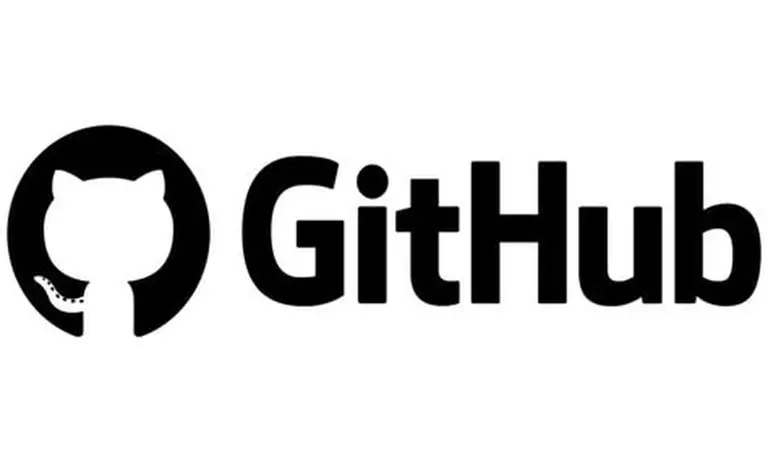

**方式四：Vibe Coding（AI 視覺生成流程）**
隨著具有強大多模態視覺理解能力的 AI Agent 的出現，你只需要在網上看到喜歡的網站風格，截圖後告訴 AI：「按照這個風格幫我寫一個網頁。」AI 就能分析視覺元素並為你生成底層程式碼。


**本教學的選擇：GitHub Pages + 學術模板 + AI 修改。**
原因很簡單：

* **零成本**：不需要買伺服器，不需要買網域名稱。
* **高品質**：模板通常由頂級開發者設計，風格簡約，結構專業，載入速度快。
* **易維護**：你主要寫 Markdown，類似在飛書文件或 Notion 中寫作，AI 幫你生成網頁。

## 1.4 本教學的完整路線圖

為了讓配置過程更直觀、不枯燥，我們將使用一個有趣的案例：**為馬斯克建立一個學術主頁**。

雖然 Elon Musk 不是大學教授，但他發表了許多公開的「技術白皮書」，如 *Hyperloop Alpha*，也有很多著名的專案，如 SpaceX 和 Tesla。我們將使用這些素材作為測試資料，結合 Trae 的 Vibe Coding 工作流程，走通一條可重複的建站路線：

1. **找到骨架**：在 GitHub 上找到一個高品質的網站模板並 fork 到自己的儲存庫。
2. **準備環境**：在本機拉取程式碼並配置 Trae，讓 AI 能讀取你的專案。
3. **與 AI 迭代**：將模板中的佔位人物替換為 Elon Musk，上傳他的簡歷，將「發表論文列表」改為「技術白皮書展示」，甚至讓 AI 將網站重新上色為「火星紅」。
4. **部署上線**：將修改後的程式碼推回 GitHub，立即獲得一個可存取的網站網址。

本節只負責勾勒大方向。現在只需記住主線：
**Fork 模板 -> AI 翻新 -> 推送上線**
在後面的章節中，我們將一起走完每一步。

# 2. 環境準備

## 2.1 本教學使用的工具

整個建構過程使用四個工具或資源，每個分別扮演設計師、承包商、地主或物流系統的角色。

* **一台電腦**：Windows 或 Mac 都可以。與 Android 開發通常有高記憶體要求不同，網頁開發非常輕量，在普通的辦公筆電上就能流暢運行。
* **Trae**：這是你的 **AI 程式設計夥伴**，也是核心生產力工具。在 Vibe Coding 模式下，你不需要掌握 HTML 或 CSS 語法。你主要用自然語言告訴 AI，比如「把導航欄改成黑色」或「把馬斯克的照片放在這裡」，讓它幫你寫和修改程式碼。
* **一個 GitHub 帳號**：這是你的**免費伺服器和程式碼保險庫**。我們需要它來儲存所有網站檔案。最重要的是，我們將使用 **GitHub Pages** 免費將程式碼變成一個全球可存取的 URL，省去購買伺服器或網域名稱的需要。
* **Git 環境**：這是幕後的**快遞員**。雖然我們在 Trae 中本機寫程式碼，但 Git 是將程式碼從你的電腦推送到 GitHub 的工具。你不需要掌握 Git 指令，Trae 可以幫你呼叫它們，但必須先安裝 Git。
* **Ruby 環境**：這是本機的**網頁工坊**。因為本教學中的學術模板使用 Jekyll，而 Jekyll 運行在 Ruby 上，所以我們需要在本機安裝 Ruby，以便在推送到線上之前先在自己的電腦上預覽網站。

## 2.2 下載 Trae

**Trae** 是我們進行 Vibe Coding 的主戰場。你可以把它想像成一個**內建超級 AI 的程式碼編輯器**。不同於傳統冷冰冰的編輯器，它就像一個經驗豐富的程式設計師坐在你旁邊，隨時準備幫忙。

* **下載地址**：造訪官網 [https://www.trae.cn](https://www.trae.cn) 並下載適合你作業系統的版本（Windows 或 Mac）。
* **安裝**：安裝非常簡單，就像安裝微信或 QQ 一樣。雙擊安裝包並點擊「下一步」直到完成。

準備好這個工具後，在後面的實作步驟中我們不需要盯著枯燥的程式碼面板。我們直接在這裡開啟專案，使用右側的聊天面板用自然語言（中文也可以）告訴 AI 幫我們寫程式碼、修 bug，甚至重構整個頁面。


## 2.3 下載 Git

**什麼是 Git？**
如果 Trae 是 Vibe Coding 中負責寫程式碼的 AI 工程師，那麼 **Git 就是負責運送程式碼的快遞員**。你需要它將在電腦上寫好的程式碼安全地推送到 GitHub——你的雲端儲存庫。沒有它，你的網站只能在你的機器上運行，其他人看不到。

過去，你需要去官網下載安裝程式並手動配置環境變數，很煩人。現在我們可以直接讓 Trae 幫忙偵測和安裝。

**第一步：檢查 Git 是否已安裝**

開啟 Trae，在右下方的聊天面板中輸入以下指令：

```markdown
請幫我檢查這台電腦是否已經安裝了 Git。請在終端機中執行 `git --version` 指令。
```

* **情況 A（已安裝）**：如果你看到類似 `git version 2.xx.x` 的內容，恭喜你。你可以直接跳過安裝步驟。
* **情況 B（未安裝）**：如果你看到 "command not found" 或一堆紅色錯誤訊息，繼續下面的步驟。

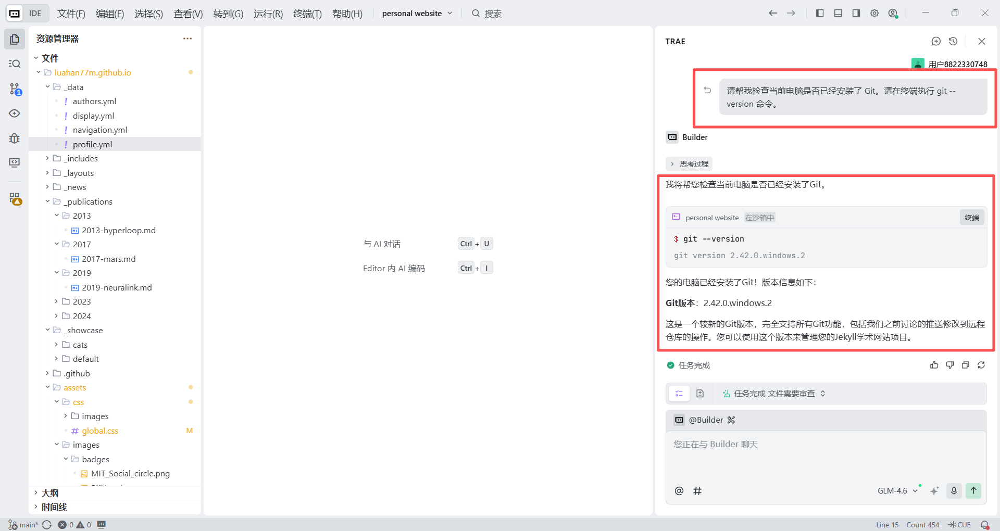

**第二步：AI 輔助安裝**

不要關閉 Trae。繼續在聊天面板中輸入：

**Windows 使用者的指令：**

```markdown
我還沒有安裝 Git。請寫出使用 `winget` 命令列工具自動安裝 Git 的指令，並告訴我如何在終端機中執行。
```

**Mac 使用者的指令：**

```markdown
我還沒有安裝 Git。請告訴我如何透過終端機指令快速安裝 Git，例如使用 `git` 或 `brew`。
```

Trae 會給你一條指令，通常是類似 `winget install --id Git.Git` 的東西。

你只需要點擊程式碼區塊中的**在終端機中執行**按鈕，或者複製到底部的終端機中按 Enter。它會自動為你下載並安裝 Git。

如果你仍然覺得 AI 輔助的過程還不夠完美，可以參考這篇教學進行手動下載和安裝：
[Git 下載和安裝教學](https://blog.csdn.net/weixin_41293671/article/details/144255269?ops_request_misc=elastic_search_misc&request_id=63236900b52320a7beb177787ba97f07&biz_id=0&utm_medium=distribute.pc_search_result.none-task-blog-2~all~baidu_landing_v2~default-5-144255269-null-null.142^v102^pc_search_result_base4&utm_term=git%E4%B8%8B%E8%BD%BD%E5%AE%89%E8%A3%85&spm=1018.2226.3001.4187)

## 2.4 安裝 Ruby 環境

在我們正式開始寫程式碼之前，還需要最後一塊拼圖。本教學使用的學術主頁模板是用 Jekyll 建構的，而 Jekyll 本身基於 Ruby 程式語言。

為了在將程式碼推送到 GitHub 讓全世界看到之前，先在自己的電腦上預覽和除錯「裝修效果」，我們必須在電腦上安裝 Ruby 環境。把這想像成在你的電腦上雇了一個懂 Ruby 的翻譯。別擔心，你不需要學習如何寫 Ruby。你只需要安裝它，Trae 可以處理剩下的工作。

### 2.4.1 Windows 安裝

**第一步：使用國內鏡像下載安裝程式**

對於 Windows 使用者，官網 https://rubyinstaller.org/downloads/ 提供了一鍵安裝程式，但由於網路差異，了解一個技巧會有幫助。官方對初學者的推薦通常是 **`Ruby+Devkit 3.X.X (x64)`**，因為它包含了所需的工具鏈。

**初學者提醒**：在實際操作中，從官網直接下載可能很慢或失敗。我們強烈推薦使用國內鏡像 [RubyInstaller for Windows - 國內鏡像](https://rubyinstaller.cn/)，通常會快很多。

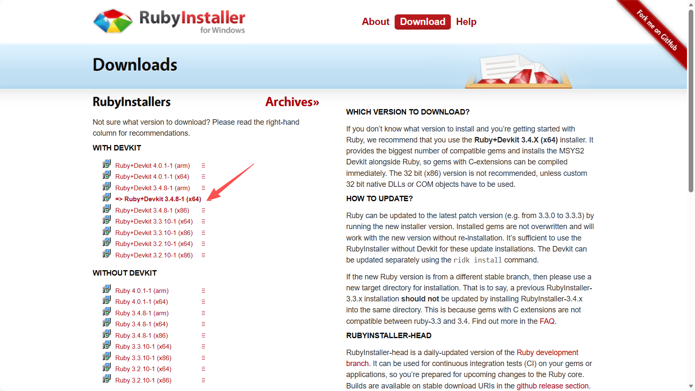

**第二步：執行安裝**

雙擊下載的安裝程式。在安裝精靈中，確保勾選 **"Add Ruby executables to your PATH."** 這是最重要的一步。否則電腦將無法「找到」你剛安裝的翻譯器。

勾選後，繼續點擊 **Next** 完成安裝。

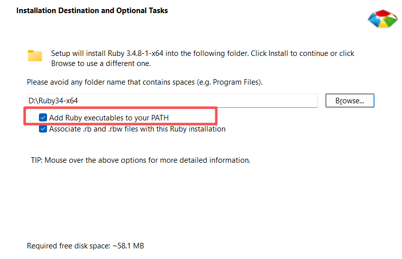

**第三步：配置開發工具包**

當安裝進度完成後，會自動打開一個黑色的命令列視窗。不要慌張。在游標閃爍的地方輸入數字 `3`，這表示安裝 MSYS2 基礎環境和 MINGW 工具鏈，然後按 Enter。等待指令執行完畢，視窗會自動關閉。

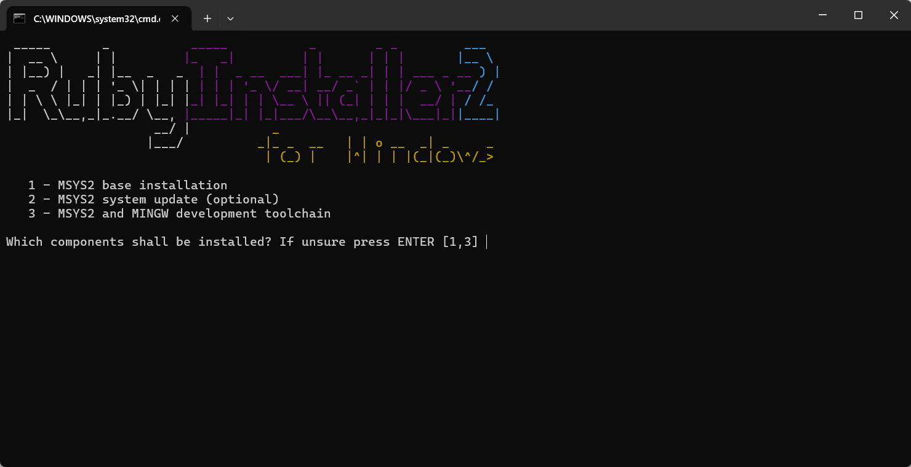

**第四步：驗證結果**

現在是讓 AI 幫你檢查作業的時候了。開啟 Trae，在右側的聊天中輸入以下自然語言指令：

```markdown
請幫我檢查這台電腦是否已正確安裝了 Ruby 環境。請在底部的終端機中執行 `ruby -v` 指令並告訴我結果。
```

如果 Trae 回覆類似 `ruby 3.x.x` 的內容，那麼你的 Windows Ruby 環境就完全設定好了。

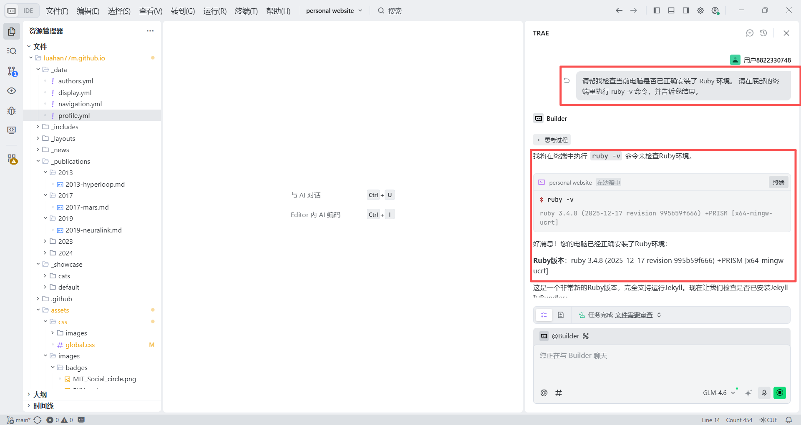

### 2.4.2 Mac 安裝

配置 Mac 環境感覺更「極客」，因為通常需要終端機指令。但在 Vibe Coding 模式下，我們甚至不需要手動開啟終端機。我們可以直接讓 Trae 當我們的私人 IT 操作員。

**第一步：給出一鍵環境設定指令**

開啟 Trae，將以下自然語言指令貼到右側的聊天中。我們讓它處理檢查 Homebrew、安裝（如果缺少）、然後安裝 Ruby：

```markdown
我使用的是 Mac 電腦，需要配置 Ruby 開發環境。請幫我完成以下步驟：
1. 檢查是否已安裝 Homebrew。如果沒有，請在終端機中執行 Homebrew 的官方安裝腳本。
2. 確認 Homebrew 就緒後，在終端機中執行 `brew install ruby`。
3. 一切完成後，執行 `ruby -v` 確認安裝成功。
請一步步引導我，並在必要時提供我可以直接點擊執行的終端機指令。
```

收到指令後，Trae 會開始工作，並在聊天面板中顯示帶有執行按鈕的程式碼區塊。

**初學者重要提醒**

安裝 Homebrew 時，終端機通常會提示類似 `Password:` 的內容，要求你輸入 Mac 登入密碼。

**注意：** 在 Mac 終端機中輸入密碼時，螢幕不會顯示任何字元或星號。這是正常的。直接盲打密碼然後按 Enter 即可。

**第二步：驗證結果**

安裝完成後，回到 Trae 輸入：

```markdown
我剛透過 `brew` 在這台 Mac 上安裝了 Ruby。請幫我在終端機中執行 `ruby -v` 指令並檢查安裝和環境變數是否正確。
```

當你在終端機中看到類似 `ruby 3.x.x` 的內容時，本機網頁工坊就準備好了，你的 Mac 已經為 Vibe Coding 做好了準備。

## 2.5 註冊 GitHub 帳號

**什麼是 GitHub？**
如果 Git 是快遞員，那麼 **GitHub 就是雲端倉庫和展示廳**。它不僅免費託管你的程式碼，更重要的是，透過 **GitHub Pages** 它可以將你的程式碼變成一個全球可存取的網站 URL。它也是全球最大的程式碼託管平台，擁有 GitHub 帳號就像是拿到了技術世界的護照。

**註冊步驟：**

1. **造訪官網**：開啟 [https://github.com/](https://github.com/)。
2. **點擊 Sign up**：點擊右上角的 **"Sign up"**。

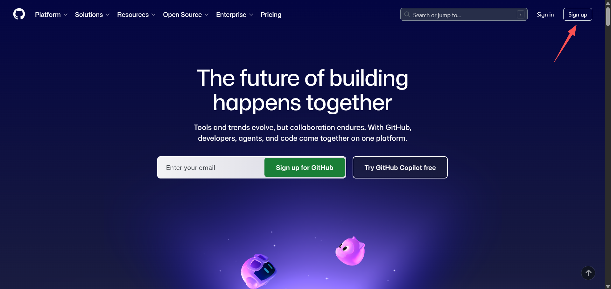

3. **填寫你的資訊**
4. **電子郵件**：輸入真實的電子郵件地址。
5. **密碼**：選擇一個強密碼。
6. **使用者名稱（重要！）**：**請慎重選擇**。你的主頁 URL 之後會變成 **`https://your-username.github.io`**。最好使用你的英文名、拼音、熟悉的 ID 或簡單的字母和數字組合。**不要**選擇像 `a1b2c3d4` 這樣的名稱，否則你的網站連結會很難記住。
7. **驗證和啟用**：完成人機驗證（通常是旋轉圖片或選擇螺旋星系），然後在電子郵件中查看驗證碼。

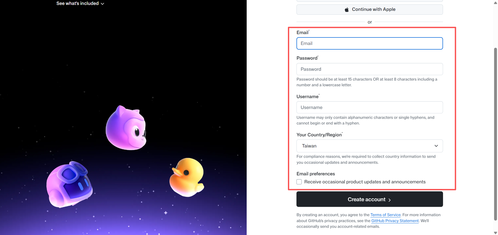

註冊完成後，你就擁有了網際網路上的一塊地。在下一節中，我們將開始在這塊地上建造。


# 3. 從模板到你的第一個可存取頁面

一切準備就緒。在前兩章中我們準備了工具。本章我們將正式在網際網路上圈地。本章的任務很簡單：
**先不用擔心裝修或內容。先建好網站的骨架，拿到一個可存取的連結。**

我們將直接 fork 一個成熟的學術模板，使用 GitHub Pages 自動化在二十分鐘內讓它運行起來。完成後，你將擁有一個全球可存取的連結。

## 3.1 取得一個網站模板

在 Vibe Coding 模式下，我們不需要從頭寫 HTML。GitHub 上有成千上萬個優秀的開源模板。我們只需要「借」一個並把名字改成自己的。

**第一步：找一個模板**

這裡我們選擇了一個結構清晰、學術展示適用性強的經典模板：
https://github.com/luost26/academic-homepage?tab=readme-ov-file
這個模板基於 Jekyll 框架。

當然，你也可以在 GitHub 上搜尋 **`academic-homepage`** 並挑選你喜歡的其他風格，但為了跟隨本教學，建議先使用上面的模板。

我們還為你準備了幾個額外的模板推薦：

* Minimal Light 個人主頁主題：https://github.com/yaoyao-liu/minimal-light?
* Minimal Mistakes：[https://github.com/mmistakes/minimal-mistakes](https://github.com/mmistakes/minimal-mistakes?utm_source=chatgpt.com)
* Pixyll：https://github.com/johno/pixyll
* Hydejack：https://github.com/hydecorp/hydejack
* Forty Jekyll Theme：https://github.com/andrewbanchich/forty-jekyll-theme
* Leonids：https://github.com/github.com/renyuanz/leonids
* YAT：https://github.com/jeffreytse/jekyll-theme-yat

**第二步：Fork 專案**

造訪目標儲存庫主頁，點擊右上角的 **Fork** 按鈕。會彈出一個確認框，直接點擊 **Create Fork**。

* 解釋：這一步相當於將別人的程式碼儲存庫連同一整套鑰匙複製到你自己的 GitHub 帳號中。現在，你擁有了這個網站的副本。

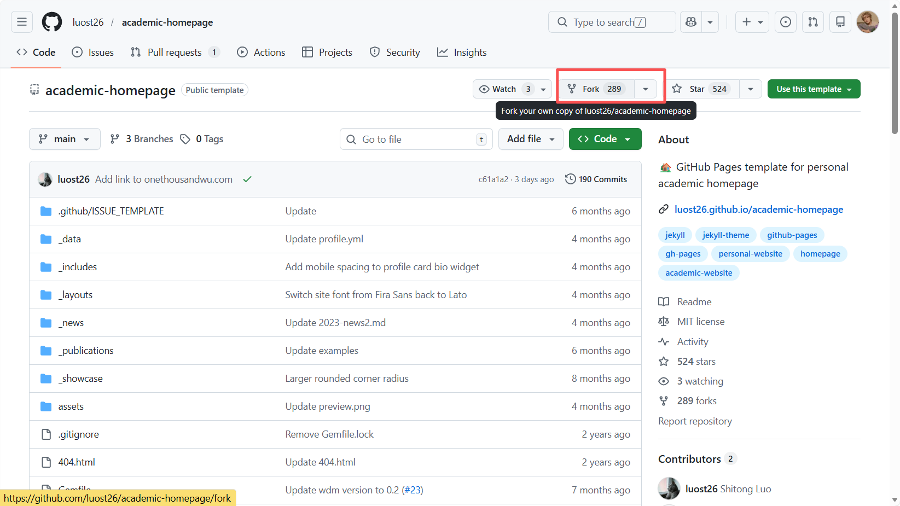

**第三步：重新命名儲存庫（最重要的一步）**

將儲存庫名稱改為：
`your-username.github.io`

**初學者重要提醒**：
這是 GitHub Pages 的硬性規定。
例如，如果你的 GitHub 使用者名稱是 `musk-fan`，那麼儲存庫名稱**必須**是 `musk-fan.github.io`。
只有這樣 GitHub 才會自動為你分配一個免費的網域名稱。如果名稱錯誤，網頁之後就打不開。

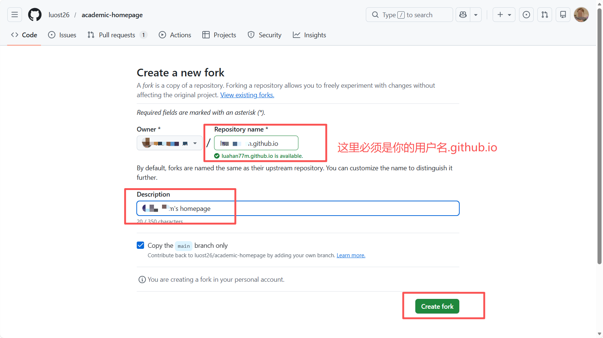

## 3.2 取得 GitHub 專案 URL

重新命名後，我們需要儲存庫的提貨單。

1. 返回儲存庫主頁，在 **Code** 標籤下。
2. 點擊綠色的 **Code** 按鈕。
3. 確保選中 **HTTPS** 標籤。
4. 點擊複製按鈕，複製以 `.git` 結尾的 URL，例如 `https://github.com/musk-fan/musk-fan.github.io.git`。

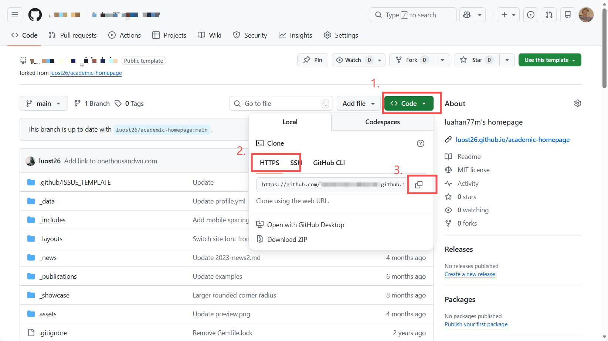

## 3.3 將專案拉取到本機

過去，程式設計師必須在黑色的終端機中輸入複雜的 Git 指令才能下載程式碼。在 Vibe Coding 時代，我們有 Trae。我們只需要告訴 AI：「我要這個，幫我拉下來。」

**第一步：準備工作**

在你的電腦上建立一個新資料夾，例如 `MyWebsite`，然後右鍵選擇 **Open with Trae**，或者先開啟 Trae 再選擇 **Open Folder**。

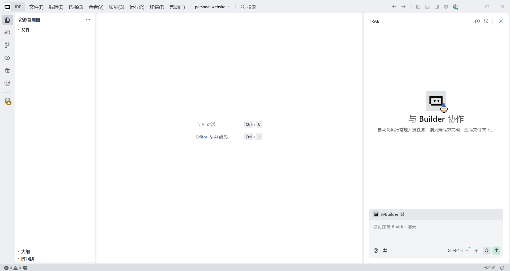

**第二步：給出 clone 指令**

Trae 開啟後，調出右側的 AI 聊天面板，輸入以下自然語言指令：

```text
請幫我將遠端 GitHub 儲存庫克隆到當前資料夾。
儲存庫地址：貼上你剛才複製的 URL，例如 https://github.com/musk-fan/musk-fan.github.io.git
執行要求：請直接在終端機中執行 `git clone` 指令。
```

**第三步：確認下載**

Trae 會自動呼叫底部的終端機並執行指令。等待幾秒鐘。當你看到 `_config.yml` 和 `index.html` 等檔案出現在左側的檔案樹中時，專案已經成功搬遷到你的電腦上了。

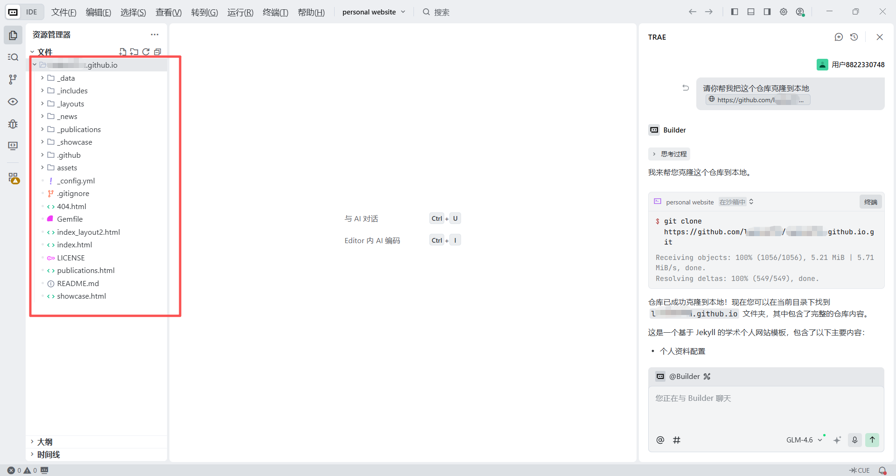

## 3.4 在本機預覽網頁

程式碼已經在你的機器上了，Ruby 環境也準備好了。在修改網站之前，我們必須先在自己的電腦上本機檢視。這就像裝修房子：你先在樣板間裡把所有東西佈置好，確認看起來沒問題，然後才公開展示。

得益於 **2.4 節**中安裝的 Ruby 環境，這現在非常簡單。

**第一步：安裝依賴**

一個 Jekyll 網站依賴許多 Gem 才能運行。這就像按照購物清單買齊所有家具。**但是**，由於網路條件，直接下載可能會卡住。我們會讓 Trae **切換到國內鏡像**並在那裡安裝依賴。

在 Trae 的聊天框中輸入：

```markdown
我需要安裝 Jekyll 的依賴。考慮到網路環境，請先將 Gemfile 中的 `source` 改為國內鏡像 `https://gems.ruby-china.com/`。之後請在終端機中執行 `bundle install` 指令安裝所有依賴。
```

**第二步：啟動本機服務**

現在我們將啟動一個**本機伺服器**來模擬網站運行。繼續告訴 Trae：

```markdown
依賴已經安裝完成。請幫我在終端機中啟動 Jekyll 本機預覽服務。請執行 `bundle exec jekyll serve` 指令。
```

終端機執行幾秒鐘後，你會看到類似以下的內容：
`Server address: http://127.0.0.1:4000/academic-homepage/`

1. **開啟瀏覽器**：點擊那個連結，或直接在瀏覽器中輸入：
   `http://127.0.0.1:4000/academic-homepage/`
2. **見證奇蹟**：現在你的網站已經在瀏覽器中運行了。雖然它仍然顯示原始模板作者的名字，但它已經在你的電腦上本機運行了。

從現在開始，每當你修改內容並按 `Ctrl+S`，然後重新整理瀏覽器，**網頁內容就會跟著變化**。

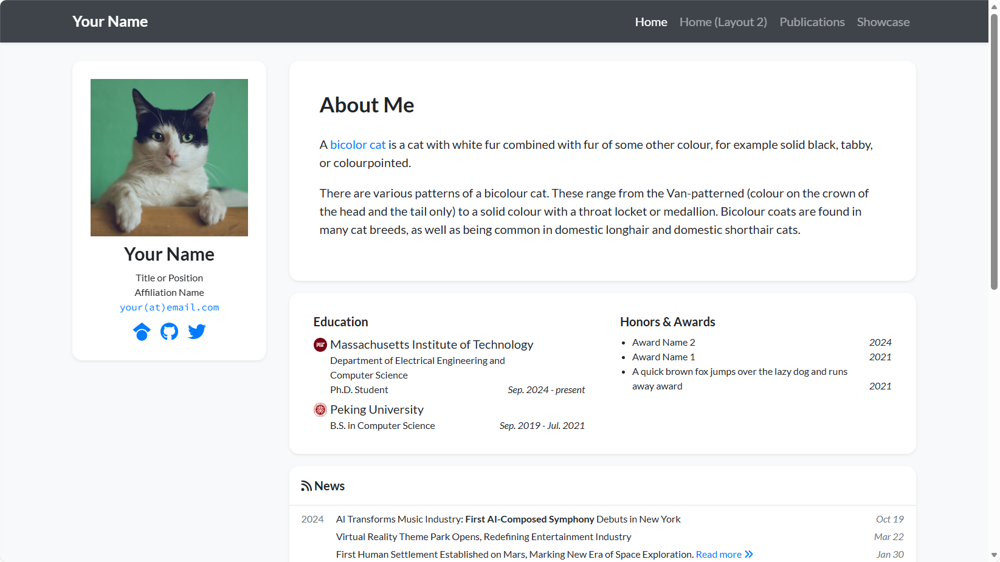

本機預覽成功後，我們就可以進入下一章，開始將網站變成馬斯克的樣子了。

# 4. AI 輔助內容修改

為了幫大家快速體驗完整流程，我們不會使用自己的個人資訊，以避免隱私焦慮。相反，我們將以 **Elon Musk 為例**，為他建立一個學術主頁。這讓我們可以放下寫個人簡歷的無聊壓力，專注於 Vibe Coding 建站的樂趣。同時也能看到把一個矽谷鐵人的「技術白皮書」（如 *Hyperloop Alpha*）放在學術風格的網站上有多酷。

我們將走完從**取得模板**到**發佈網站**的完整閉環，親手打造一個世界級的個人展示空間。

跟著我的節奏，向 AI 發送第一條指令。

## 4.1 統一的全域約束

這是**全域設定提示詞**。你只需要發送一次。
它的目的是為 AI 設定規則，防止它即興發揮並破壞網站結構。直接複製到 Trae 中：

```text
你現在是「GitHub Pages + Jekyll 學術主頁模板」網站的維護者。
當前儲存庫是一個基於 Jekyll 的學術主頁（包含 `_config.yml`、`_data`、`_layouts` 等）。
你的修改必須遵循以下原則：
1. 每一步只解決當前階段的目標。不要提前做後續階段的內容。
2. 不要修改網站結構，不要引入新的外掛，不要改變主題風格。
3. 所有內容必須能被 Jekyll 正確渲染，不能有錯誤。
4. 所有身份資訊必須遵循「學術風格模擬」的語氣，不得使用第一人稱。
5. 不要編造明顯虛假的 IEEE / Nature 論文。
6. 如果資訊不確定，使用「公開已知的事實」或「合理的學術模擬標註」。
```

## 4.2 建構馬斯克的主頁（內容部分）

### 4.2.1 第一條全域指令：替換身份

我們首先需要解決的是「我是誰？」模板裡充斥著原作者的資訊，我們需要用 AI 一次性替換掉。

**第一步：準備素材**

將我提供給你的圖片素材 `University_of_Pennsylvania.jpg` 和 `Queen_University.jpg` 放入對應的專案資料夾，通常是 `/assets/images/badges/`。


**第二步：發送指令**

在 Trae 右側的聊天框中，輸入以下提示詞。注意我們不需要手動查找和編輯行。我們只需要告訴 AI 我們想要什麼：

```text
1. 目標：將當前學術主頁的「人物身份」替換為 Elon Musk。只修改基本資料資訊。
2. 具體要求：
1. 姓名：Elon Musk
2. 職業身份：
    科技企業家
    工程師
    SpaceX 創辦人兼執行長
    Tesla, Inc. 執行長
3. 教育背景：
    皇后大學（物理學和經濟學，未完成）（圖片路徑：/assets/images/badges/Queen_University.jpg）
    賓夕法尼亞大學（物理學學士，經濟學學士）（圖片路徑：/assets/images/badges/University_of_Pennsylvania.jpg）
4. 研究興趣（可模擬為）：
    太空系統工程
    可持續能源系統
    人工智慧與機器人技術
    大規模科技創新
5. 榮譽與獎項：
    《時代》年度風雲人物（2021）
    英國皇家學會院士（FRS）
    入選《富比士》億萬富豪榜（多年）
6. 約束條件：
    不要添加論文 / 發表作品
    不要編造 IEEE、Nature 或 Science 論文
    使用學術風格的措辭，避免商業宣傳語氣
    保持原始欄位結構不變，只替換內容
```

此時，你可以看到 Trae 已經完成了我們所有的修改要求。

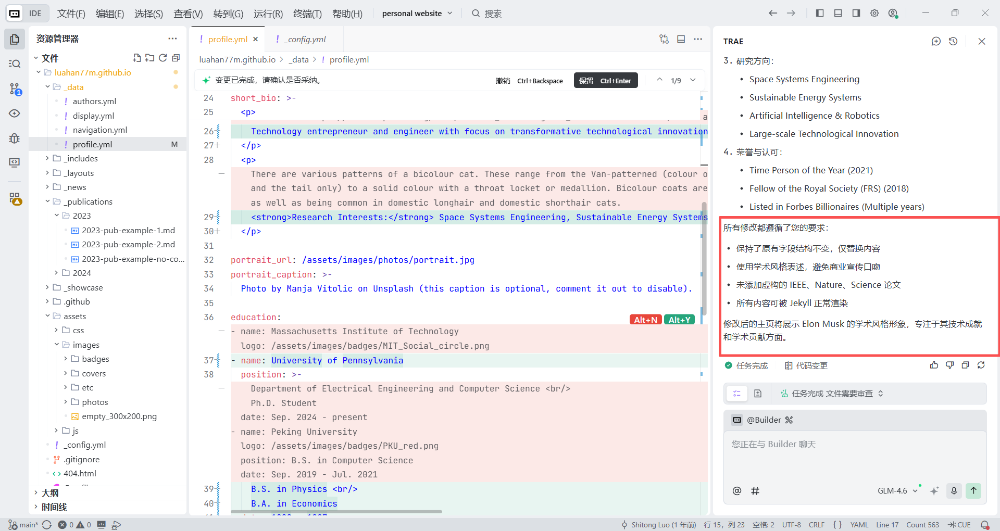

**第三步：重新整理本機瀏覽器**

現在重新整理本機瀏覽器，你應該能看到所有內容都已正確替換。

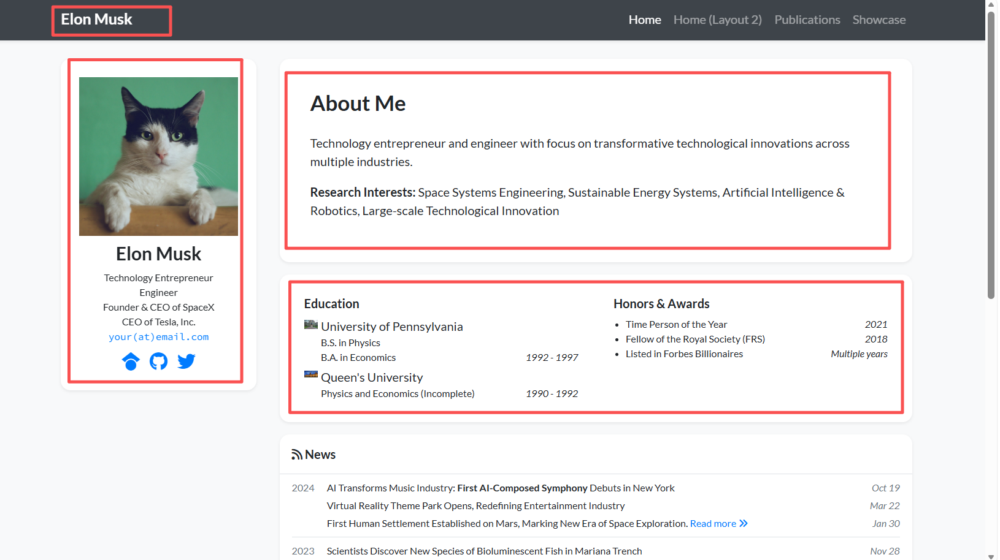

### 4.2.2 迭代改進：新增「論文」和專案

因為 Elon Musk 不是傳統的大學教授，他很少在 *Nature* 或 *Science* 上發表論文。但作為「總工程師」，他發布了許多技術含量很高的**白皮書**和**大師計畫**。

在學術主頁的語境下，我們可以將「Publications」的含義重新定義為**「技術白皮書與願景計畫」**。這一點也不尷尬。事實上，這非常符合他的建造者身份。

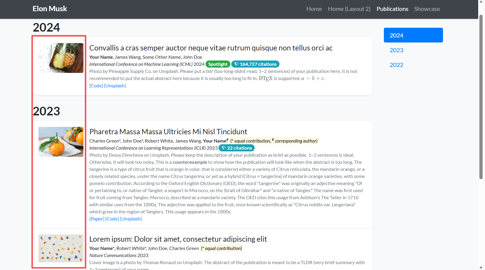

**第一步：準備素材**

下載我提供的封面圖片，即 `Hyperloop_Alpha_sketch.jpg`、`SpaceX_Starship.jpg` 和 `Neuralink_sewing_machine_robot.jpg`，將它們放在 `/assets/images/covers/` 下，並刪除該資料夾中原來的範例圖片。

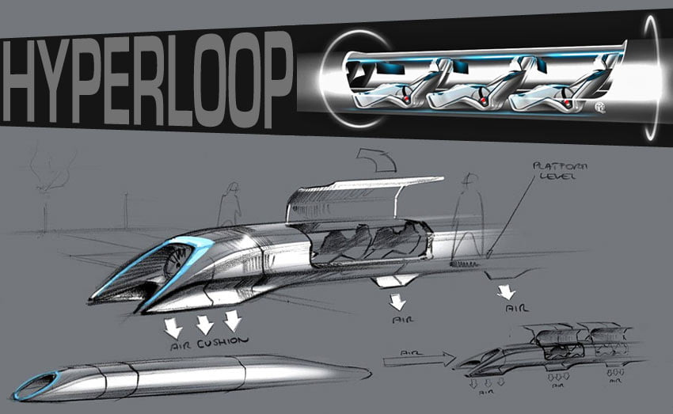
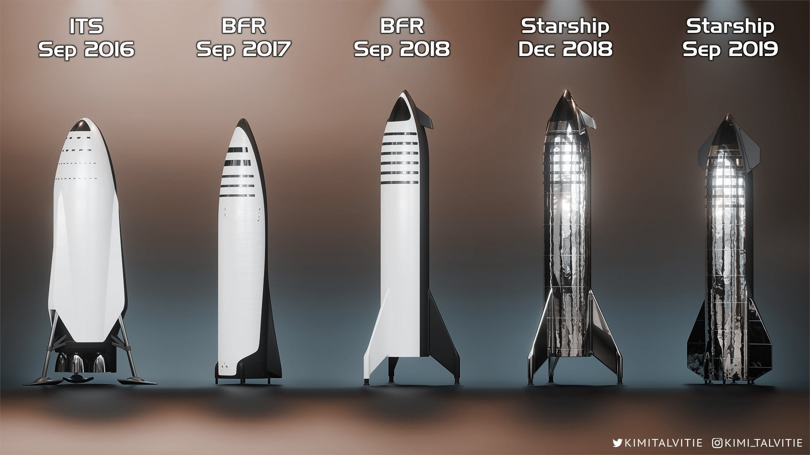


**第二步：發送指令**

將以下提示詞發送給 Trae，讓它幫我們重建資料結構：

```text
1. 角色設定：你是一個精通 Jekyll 和 Liquid 語法的靜態網站開發專家。
2. 任務目標：
修改首頁或導航欄中的區塊標題。
當前檔案結構按年份子資料夾組織，例如 `_publications/2023/xxx.md`。
按照指定格式建立三個新的 Markdown 檔案，展示 Elon Musk 的技術白皮書和願景計畫。
3. 具體步驟和要求：
1. 修改區塊標題
    請全域搜尋字串 "Selected Publications"（它可能出現在 `index.html`、`_config.yml` 或 `_pages/publications.md` 中）。
    將其替換為："Technical White Papers & Visionary Plans"。
2. 重建發表作品資料（關鍵步驟）
    清除 `_publications` 資料夾下的所有舊內容，包括 2023 和 2024 等舊的年份資料夾。
    建立三個新資料夾：`_publications/2013/`、`_publications/2017/` 和 `_publications/2019/`。
    在這些資料夾中，建立以下三個 Markdown 檔案。
3. 嚴格遵循以下檔案格式
重要：你必須嚴格遵循以下 YAML Front Matter 格式，不得編造新的欄位名稱：
    - title:          "論文標題"
    - date:           YYYY-MM-DD HH:MM:SS +0800
    - selected:       true
    - pub:            "發表場合 / 期刊名稱"
    - pub_date:       "年份"
    - abstract: >-    摘要內容...
    - cover:          /assets/images/covers/cover_name.jpg
    - authors:        - 作者1- 作者2
    - links:Paper:    https://paper-link
4. 請生成以下三個檔案的完整程式碼（包括路徑說明）：
(1) 路徑：`_publications/2013/2013-hyperloop.md`
    標題：Hyperloop Alpha
    日期：2013-08-12
    Pub：Tesla Blog (Open Source)
    Pub_date："2013"
    Abstract：第五種交通方式的提案，利用低壓管道和空氣軸承實現次音速。
    cover：/assets/images/covers/Hyperloop_Alpha_sketch.jpg
    Authors：Elon Musk, SpaceX & Tesla Teams
    Link：https://www.tesla.com/sites/default/files/blog_images/hyperloop-alpha.pdf
(2) 路徑：`_publications/2017/2017-mars.md`
    標題：Making Humans a Multi-Planetary Species
    日期：2017-06-01
    Pub：New Space
    Pub_date："2017"
    Abstract：為殖民火星而設計的 Starship 系統的詳細架構。本文概述了建立自持續城市所面臨的技術挑戰。
    cover：/assets/images/covers/SpaceX_Starship.jpg
    Authors：Elon Musk
    Link：https://www.liebertpub.com/doi/10.1089/space.2017.29009.emu
(3) 路徑：`_publications/2019/2019-neuralink.md`
    標題：An Integrated Brain-Machine Interface Platform
    日期：2019-10-16
    Pub：Journal of Medical Internet Research
    Pub_date："2019"
    Abstract：我們已經建構了小型且靈活的電極線陣列，每個陣列最多有 3,072 個電極，以及一個神經外科機器人。
    cover：/assets/images/covers/Neuralink_sewing_machine_robot.jpg
    Authors：Elon Musk, Neuralink
    Link：https://www.jmir.org/2019/10/e16194/
執行要求：
請直接提供這三個檔案的完整內容，以及你修改標題的檔案的修改程式碼。
```

**第三步：重新整理本機瀏覽器**

當建構完成後，你會發現原本枯燥的發表論文列表變成了一個充滿未來感的黑科技展示。

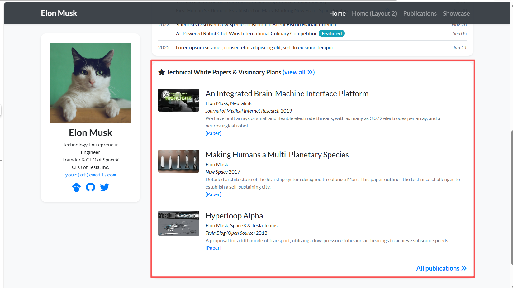

### 4.2.3 最後打磨：社交連結和頭像

這是從 90 分提升到 100 分的關鍵步驟。側邊欄可能仍然包含模板原始的 GitHub 連結或錯誤的電子郵件。我們需要將它們指向馬斯克真實的社交帳號，主要是 X.com。

**第一步：準備工作**

在 Google 上搜尋一張好看的馬斯克照片，儲存為 `portrait.png`，或拖入 Trae 中的 `images/photo` 資料夾替換原來的圖片。

**第二步：將以下提示詞複製到 Trae 中**

```text
1. 角色設定：你是一個注重細節的 Jekyll 網站開發專家。
2. 任務目標：完成網站側邊欄和個人資訊設定的最後更新。我們需要將作者的頭像、簡介和社交連結更新為 Elon Musk 的真實資訊。
請先掃描專案結構並找到控制作者資訊的設定檔。
3. 請進行以下修改：
1. 頭像路徑修正
    我已經將一張名為 `portrait.png` 的新圖片上傳到 `images/` 或 `assets/images/` 資料夾。
    請修改設定檔中的頭像路徑以指向此圖片，並確保相對路徑正確，例如 `/images/portrait.png`。
2. 社交連結清理
    請更新或移除側邊欄中的社交圖示連結：
    電子郵件：改為 `elon@spacex.com`，或者如果欄位允許，將其註解掉或移除以避免騷擾。
    Twitter / X：改為 `https://x.com/elonmusk`（這是核心連結）。
    GitHub：改為 `https://github.com/tesla` 指向 Tesla 開源儲存庫，或直接移除。
    Google Scholar：必須移除，因為他不維護這個。
    LinkedIn / ResearchGate：如果存在，全部移除。
輸出要求：
請直接提供修改後的完整設定程式碼片段。
```

**第三步：重新整理本機瀏覽器**

1. 看看側邊欄。現在用的是那張帥氣的照片了嗎？點擊 Twitter 圖示是否帶你到 X.com 了？

至此，在本機你已經擁有了一個完整的、專業的、具有鮮明馬斯克風格的個人學術主頁。

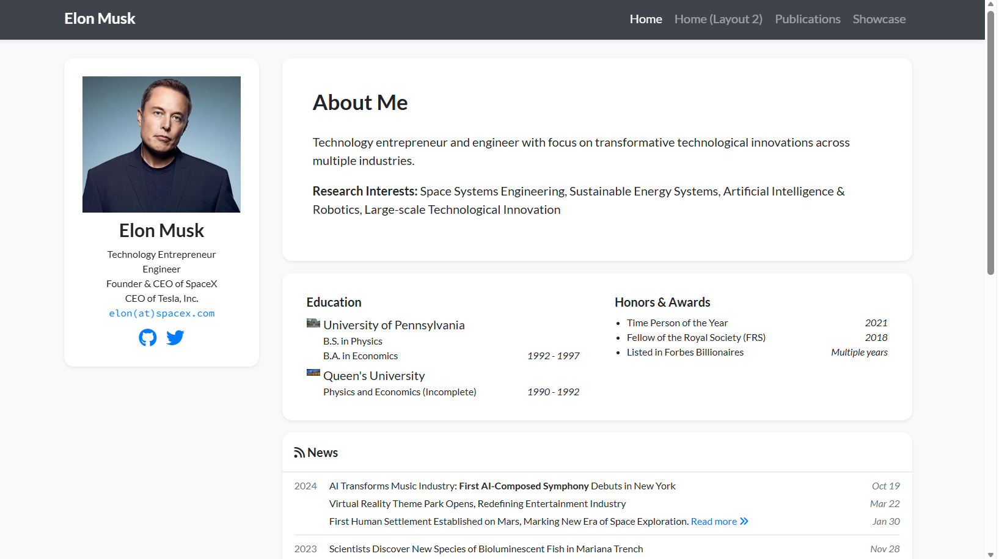

## 4.3 透過 UI 定制注入靈魂（風格部分）

現在内臉是正確的，但頁面看起來仍然像一份列印的簡歷。缺乏科技感。在 Vibe Coding 模式下，我們不需要理解 CSS。我們只需要向 AI 描述我們想要的**感覺**。

**範例場景**：
如果你覺得灰色背景太單調，想把它改成**火星紅**，只需要告訴 Trae：
*「我想把側邊欄的背景色改成深紅色（#8B0000）來體現火星的感覺。我應該修改哪個 CSS 或 SCSS 檔案？請直接給我程式碼。」*

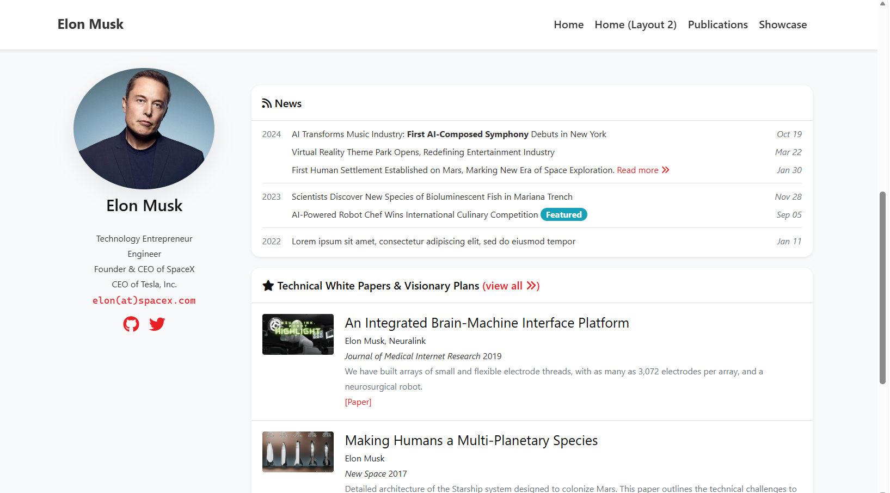

如果你喜歡上面範例圖中的 **SpaceX Dashboard** 風格，你可以直接複製以下設計師級別的提示詞：

```text
1. 角色設定：你是一位崇拜「瑞士國際主義風格」的頂級 UI 設計師，擅長 Notion、Linear 或 Apple 風格的介面。
2. 任務目標：請完全重寫 CSS / SCSS，打造一個「SpaceX Dashboard」風格的簡約學術主頁。核心關鍵詞是：透明、克制、精準。
3. 請應用以下具體的樣式覆蓋：
1. 全域排版
    字型：放棄原來的襯線字型。強制全站使用系統級的無襯線字型堆疊：
    'Inter', -apple-system, BlinkMacSystemFont, 'Segoe UI', Roboto, Helvetica, Arial, sans-serif.
    行高：在正文中增加呼吸空間，使用 `line-height: 1.75`。
    顏色：
        主標題：#111111
        正文：#333333
        次要資訊（如日期或引用）：#666666
2. 乾淨的標頭
    背景：移除之前的黑色背景，使用純白（#FFFFFF），或如果支援的話使用半透明白色加模糊效果，例如 `rgba(255, 255, 255, 0.9)` 加上 `backdrop-filter: blur(10px)`。
    邊框：只保留非常細的底邊框，`border-bottom: 1px solid #EAEAEA`。
    文字：導航連結使用深灰色 #333333，只在懸停時變成黑色和粗體。
3. 移除卡片，回歸內容
    移除左側邊欄和 About me 卡片的背景和陰影（`box-shadow: none`、`background: transparent`）。
    極簡主義讓文字直接浮在頁面背景上。
    增加間距：顯著增加區塊之間的 `margin-bottom`，例如 80px，使用留白而不是邊框來分隔內容。
4. 克制的品牌色使用
    只在連結和重要按鈕上使用 Tesla Red（#E82127）。
    連結樣式：移除底線，只改變顏色。懸停時，加上淺紅色背景區塊，例如 `background: rgba(232, 33, 39, 0.05)`。
5. 頭像調整
    保持圓形，使用 `border-radius: 50%`。
    移除邊框。
    只保留非常淡的陰影，例如 `box-shadow: 0 10px 30px rgba(0,0,0,0.08)`。
執行要求：
請分析 `_sass` 或 CSS 檔案。不要在舊程式碼上打補丁。而是直接提供重置和覆蓋以上樣式的程式碼。
```

## 4.4 替換為你自己的資訊（定制部分）

恭喜你。經歷了上面的馬斯克主頁流程後，你已經掌握了 Vibe Coding 建站的核心思維。把這個樣板間變成你自己的家其實現在很簡單。

你不需要從頭開始。你只需要重複上面的步驟，但策略更靈活一些：

**第一步：物理替換——頭像和基本資訊**

這是最簡單的一步：

1. **更換照片**：在 Trae 左側的檔案面板中，找到 `assets/images/`，把你自己的頭像拖進去，替換 `portrait.png`。
2. **更換名字**：告訴 Trae，「將全站所有 Elon Musk 替換為 [你的名字]。」

**第二步：AI 預處理——讓 ChatGPT / Gemini 幫忙整理內容**

Trae 擅長寫程式碼，但如果你直接把一份亂糟糟的 PDF 簡歷丟給它，它可能會搞混。

**所以更高效的做法是**：
先使用擅長處理長文字的 AI（如 ChatGPT、Gemini 或 Kimi）幫你**乾淨地格式化**簡歷。

你可以向 ChatGPT 發送這樣的提示詞：

```text
角色設定：你是一個專業的學術網站內容策劃師。
任務目標：
我將發送給你我的個人簡歷 / CV。請幫我從中提取關鍵資訊並整理成一個清晰的 Markdown 結構，適合直接填入靜態網站。
請嚴格按照以下五個模組整理和提煉。如果某些內容不存在，請留空。
1. 個人資料
姓名：我的全名。
標語：一句話的專業標籤，例如「CS Student @ XX Univ | AI Enthusiast」。
簡介：50 到 100 字的第三人稱介紹，總結我的背景和核心技能，使用專業的學術語氣。
社交連結：提取電子郵件、GitHub、LinkedIn、部落格連結等。
2. 教育背景
請列出：學校名稱、學位（如 B.S. in CS）和時間範圍。
選填：如果有 GPA 或核心課程，另起一行加上。
3. 精選專案 — 重要
請提取 2 到 3 個最強的專案，每個包含：
標題：專案名稱。
技術堆疊：使用的技術，如 Python、React、PyTorch。
TL;DR：一句話總結專案做什麼。
描述：2 到 3 個核心貢獻，使用 STAR 風格提煉。
圖片佔位符：預留一個圖片檔案名稱，如 `project_name.jpg`。
4. 發表作品 / 文章
如果有論文或技術文章，請提取：
標題
發表場合
日期（年份即可）
摘要（一句話總結）
5. 技能
請按類別整理：程式語言、框架 / 工具和其他技能。
輸出要求：
不要解釋過程。直接輸出整理好的 Markdown 內容。
```

取得這段清理後的文字後，把它輸入給 Trae，準確性會大幅提升。

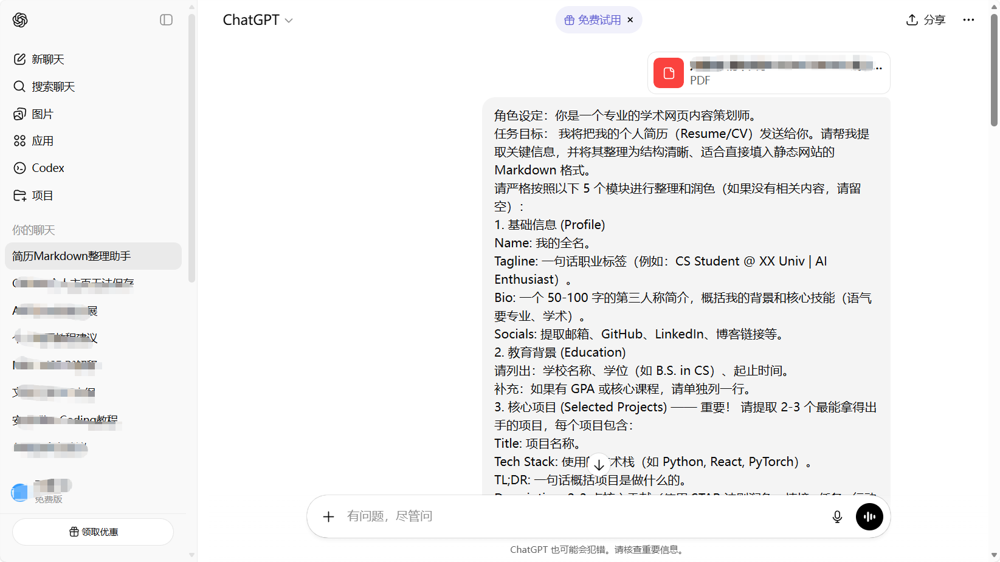
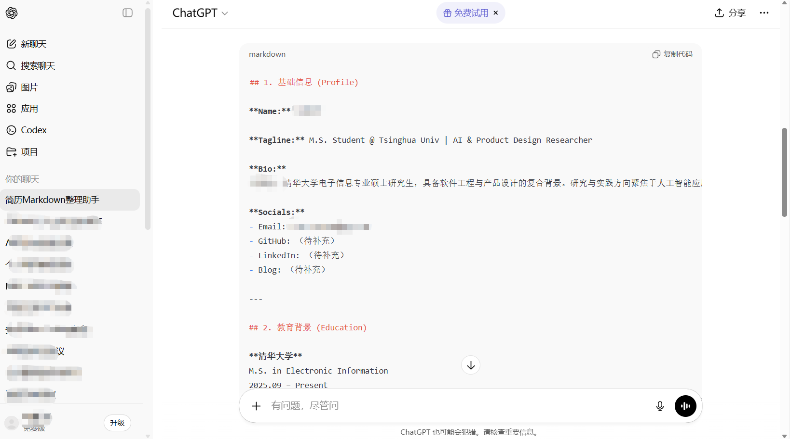

**第三步：替換核心內容（兩條路線可選）**

在這一步，根據你的偏好，你可以選擇兩種不同的 Vibe Coding 模式：

1. **模式 A：讓 AI 導航，然後手動編輯**

如果你想知道每個東西在哪裡被修改了，你可以問 Trae：

```markdown
我想修改「教育背景」區塊。請告訴我對應的檔案路徑在哪裡以及哪些行包含程式碼。
```

Trae 會在聊天中告訴你類似以下的內容：
「你需要修改的檔案是 `_pages/about.md`，相關程式碼大約在第 XX 行...」

然後你可以自己從左側的檔案樹中打開那個檔案，像結構化編輯練習一樣填入 ChatGPT 清理好的內容。

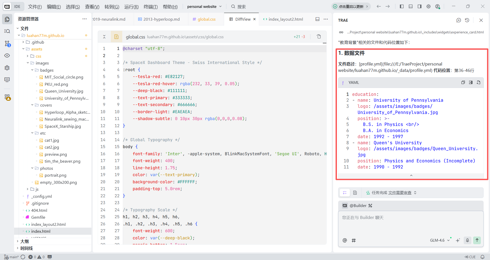

2. **模式 B：全託管自動化**

如果你覺得找檔案太麻煩，直接把清理好的資訊貼給 Trae：

```markdown
以下是我「教育背景」和「專案經驗」區塊的清理後內容（貼上 Markdown 內容）。
請直接替換當前網站中的對應內容並保持既有的版面格式。
```

# 5. 部署上線

## 5.1 部署到 GitHub Pages

**第一步：啟用 GitHub Actions（雲端建構）**

回到瀏覽器中的 GitHub：

1. 點擊儲存庫頂部的 **Settings**。
2. 在左側邊欄中點擊 **Pages**。
3. 在 **Build and deployment** 下，將 **Source** 從 `Deploy from a branch` 改為 **`GitHub Actions`**。

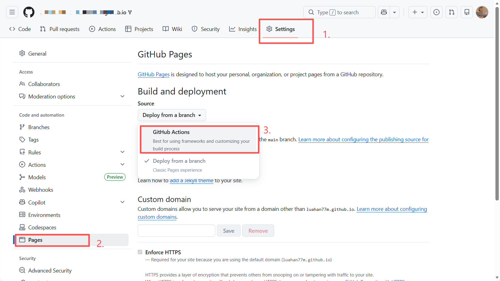

**第二步：自動配置 Jekyll 工作流程**

切換後，頁面版面會變化。GitHub 會自動識別這是一個 Jekyll 專案。

1. 找到 **Jekyll (By GitHub Actions)** 卡片。
2. 點擊該卡片上的 **Configure**。

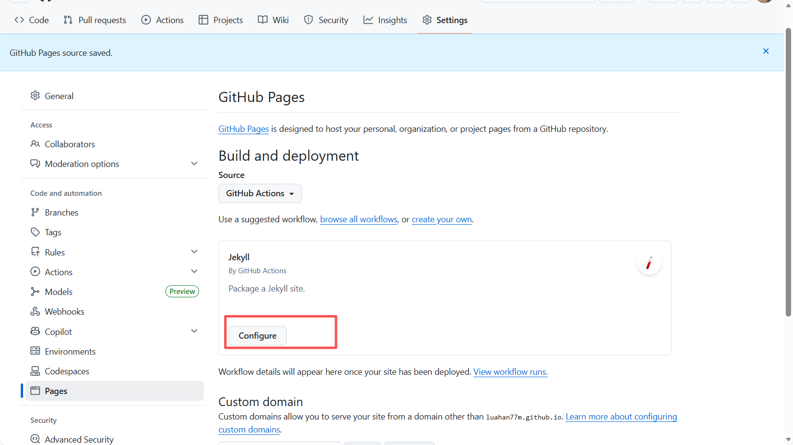

**第三步：提交設定檔**

點擊後，你會進入一個充滿程式碼的頁面。這是 GitHub 已經寫好的用於建構 Jekyll 網站的 `.yml` 設定檔。

1. **不要修改任何程式碼**。
2. 點擊右上角的綠色 **Commit changes...** 按鈕。
3. 在彈出的確認框中再次點擊 **Commit changes**。

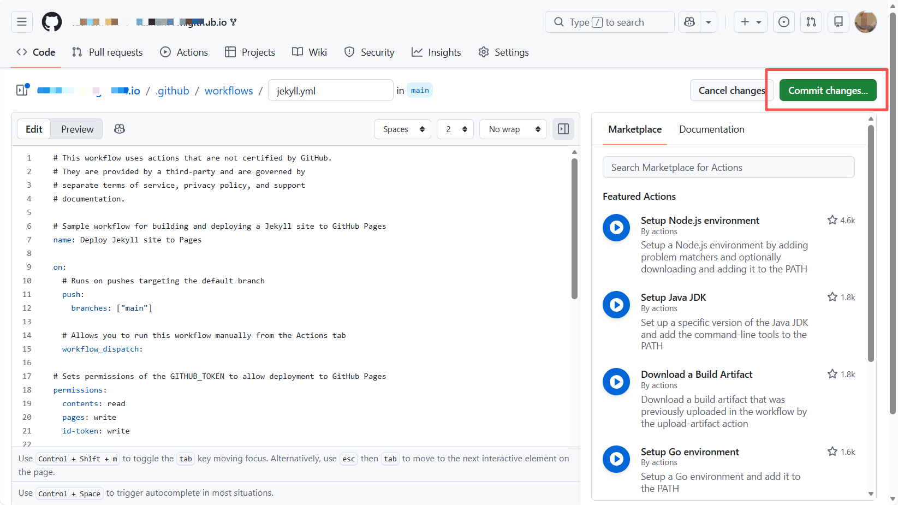

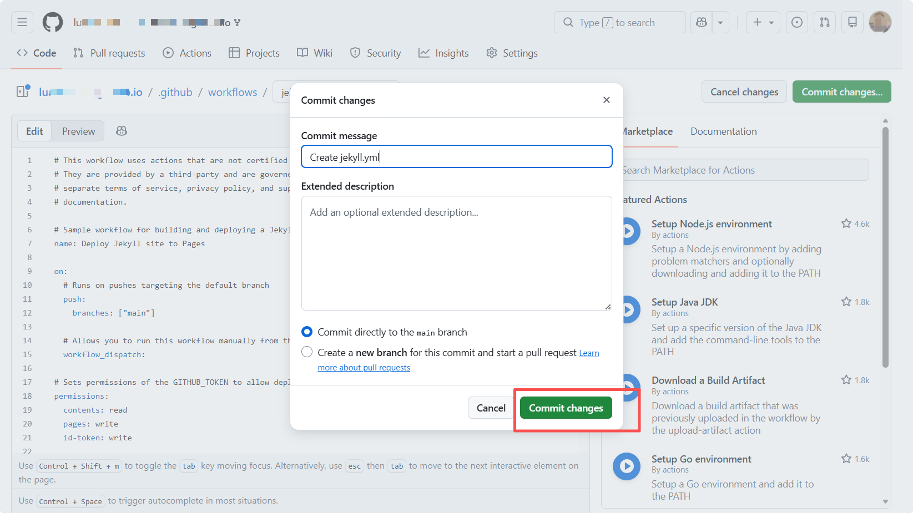

**第四步：等待並驗證**

提交後，GitHub 的伺服器會自動開始工作。

1. 點擊頂部選單中的 **Actions** 標籤。
2. 你會看到一個名為 `Deploy Jekyll site to Pages` 的任務在旋轉。
3. 等待一到兩分鐘，直到黃色圓圈變成**綠色勾選標記**。

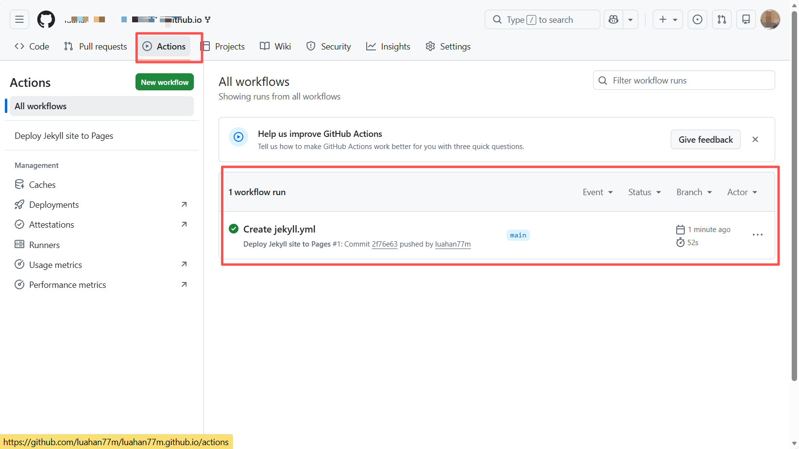

**第五步：造訪你的網站**

圓圈變綠後，你可以透過類似以下的地址存取模板的預設版本：
**`https://your-username.github.io/`**

恭喜你。你已經成功部署了一個全球可存取的個人學術主頁。

## 5.2 提交變更並更新主頁

現在我們將之前在本機做的所有修改推送到 GitHub，讓這個馬斯克風格的個人主頁被全世界看到。

1. 點擊左側的 **Source Control**。
2. 將所有**變更**加入**暫存變更**。
3. 讓 Trae 幫忙生成一個 commit 訊息，然後點擊 **Commit**。
4. 點擊 **Sync Changes** 或 **Push** 推送到 `main` 分支。
5. 等待一會兒直到 **Actions** 標籤下的所有流程完成。

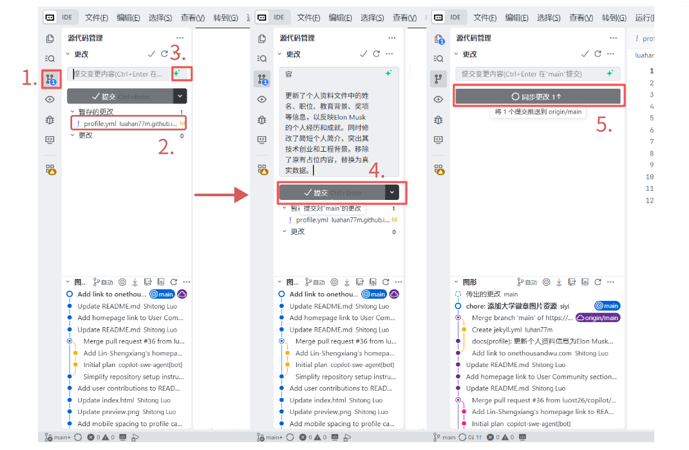

現在，恭喜你。開啟 **`https://your-username.github.io/`**，你已經擁有了一個完整的、專業的、具有濃厚馬斯克風味的學術主頁。

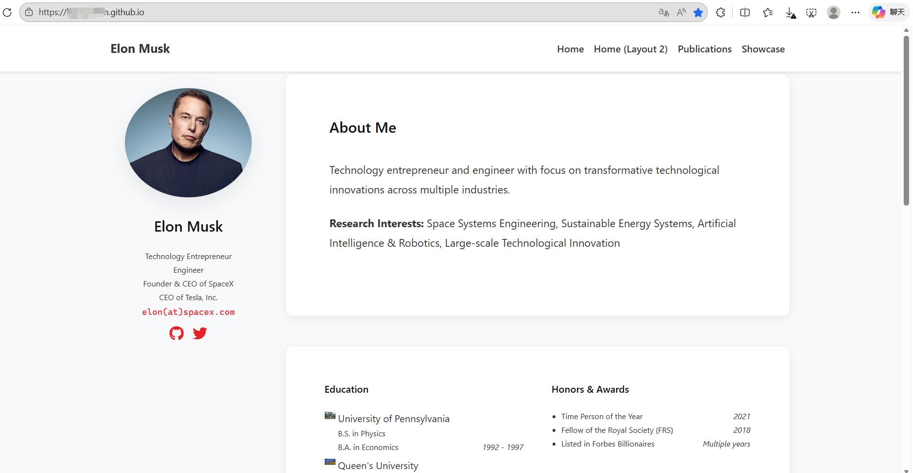

# 6. 進階玩法：從零手作個人主頁

如果你覺得學術模板太死板，或者想做一個像 *The Matrix* 一樣酷炫的單頁網站，歡迎來到 **DIY 區**。

在這裡，我們不 fork 任何人的程式碼。我們將使用 Trae，從一個空資料夾開始，用一條指令生成一個完整的網站，然後部署到線上。

## 6.1 為什麼要從零手作

* **絕對自由**：沒有模板限制。如果你想要導航欄在右邊，或者背景放煙火，只需要告訴 AI。
* **極簡主義**：模板通常包含數百個檔案，而手工網站可能只需要一個 `index.html`。
* **技術掌控**：這是理解網頁實際如何運作的最佳方式。

我們將展示經典的**純 HTML 流程**：
不需要編譯，GitHub Pages 原生支援，非常適合建構個人登陸頁。

## 6.2 實作範例：讓 AI 寫一個「火星指揮中心」主頁

這次我們不走學術路線。假設馬斯克想要一個極簡、未來感的個人主頁來展示他的火星計畫。

**第一步：建立一個空專案**

在你的電腦上建立一個新資料夾並用 Trae 開啟。此時，左側的檔案樹是完全空的。

*（提示：你可以提前準備一張馬斯克的照片並命名為 `portrait.png`。）*

**第二步：建構框架**

在 Trae 的聊天面板中輸入以下提示詞。注意我們要求 AI 將所有程式碼寫入一個檔案中，這樣對初學者來說更容易管理：

```text
我想從零開始為 Elon Musk 建構一個簡約的個人主頁，不使用任何複雜的框架，只使用 HTML + CSS + JS。
設計風格：SpaceX 儀表板風格。
    背景：使用深空黑（#000000），帶星光動畫。
    主強調色：使用「火星紅」（#E82127）。
    字型：使用等寬字型堆疊來模仿程式碼終端機的感覺。
頁面內容：
    將 Elon Musk 的頭像放在中央，圓形，帶旋轉邊框。圖片路徑為 `portrait.png`。
    姓名：Elon Musk (Technoking of Tesla)
    簡介：「Occupying Mars... 99% Loading.」
    底部放三個發光按鈕，連結到 X (Twitter)、SpaceX 和 Tesla。
技術要求：
請將所有 CSS 樣式和 HTML 結構放在一個 `index.html` 檔案中。
請直接生成完整程式碼。
```

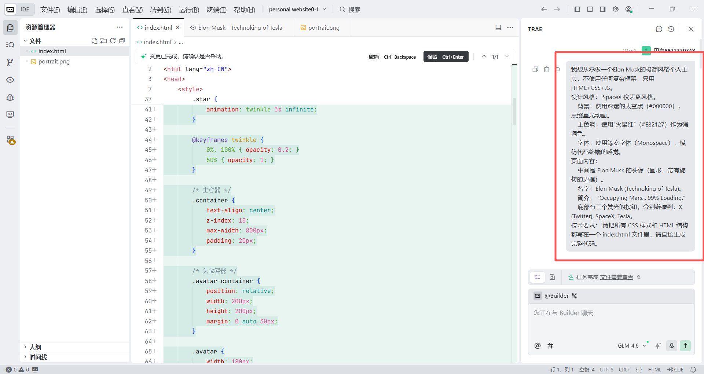

**第三步：生成並預覽**

在上一步中，Trae 已經幫我們生成了一個 `index.html` 檔案。那麼怎麼看到它目前的效果呢？

在聊天中告訴 Trae：

```markdown
請幫我啟動一個本機服務來預覽這個網頁。
```

你會收到一個連結，如 `http://localhost:8000`。複製並在瀏覽器中開啟，你會看到一個酷炫的「火星主頁」，也許背景還有星星在閃爍。

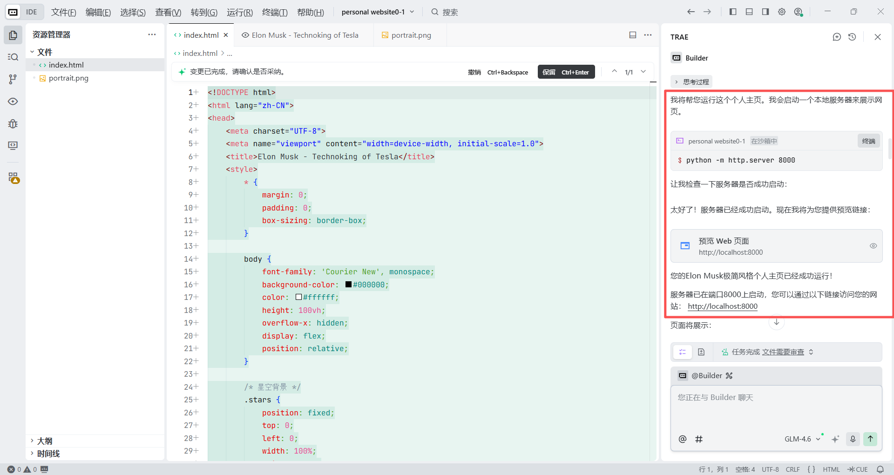

但我們會注意到當前頁面只是一個非常酷的登陸頁。作為一個完整的個人主頁，它的資訊還是太少了，缺乏學術主頁應有的深度。所以在這個視覺框架的基礎上，我們現在繼續為它豐富關於 Elon Musk 的學術風格資訊。

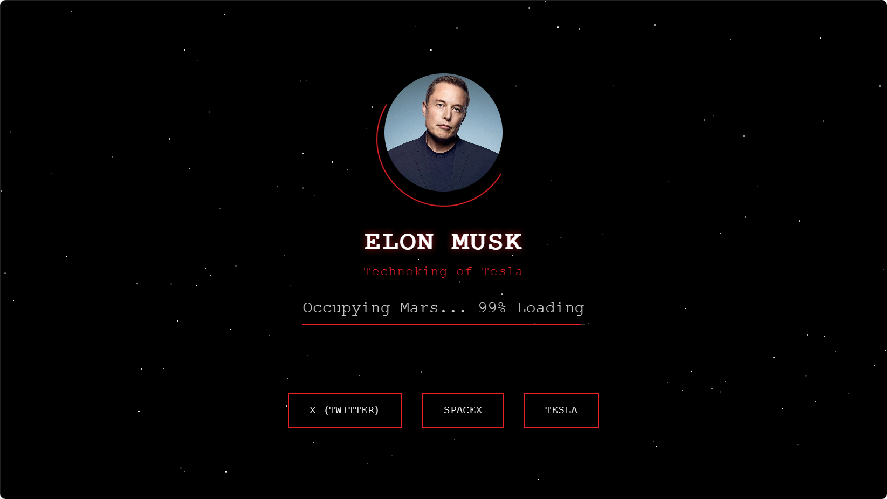

**第四步：進一步完善資訊**

我們希望 Trae 保持當前的火星風格，但將頁面重組得更像學術模板。我們需要明確告訴它將現有元素移到左側，並在右側建立一個新的內容區域用於個人資料和白皮書，同時保持所有新增內容的黑紅賽博龐克風格。

複製以下提示詞並發送給 Trae：

```text
核心原則：
你必須嚴格保留當前的「SpaceX / Mars」設計風格，包括純黑背景、星光裝飾、紅色霓虹強調色和等寬程式碼風格字型。不要使用參考圖片中的白色背景。

具體修改步驟：
1. 建立雙欄版面配置
將頁面分為左右兩欄。左側邊欄佔約 30% 到 35% 寬度，右側內容區域佔約 65% 到 70%。

2. 左側邊欄 - 移動現有資訊
將原始英雄畫面中的所有當前元素移入固定的左側邊欄：
    - 頭像：保持 Elon Musk 的圓形頭像。
    - 姓名和職稱：保持紅色霓虹文字「ELON MUSK」和「Technoking of Tesla」。
    - 載入條：保持「Occupying Mars... 99% Loading」作為個人簽名。
    - 社交按鈕：將三個紅色按鈕 X、SPACE X 和 TESLA 移到左側邊欄底部。

3. 右側內容區 - 新增詳細資訊
在右側區域新增詳細的個人介紹和成就。所有新增的正文使用白色或淺灰色，標題使用紅色霓虹強調。請建立以下區塊：
- About Me：
    寫一段簡短介紹，例如：「科技企業家和工程師，專注於多行星擴展、可持續能源和人工智慧。」
- Focus Areas：
    列出太空系統工程、火星殖民架構、腦機介面。
- Visionary Plans & White Papers：
    這是關鍵區塊。參考範例圖中的列表風格，但將其轉換為黑色背景風格。
    建立一個列表展示他的重要技術計畫，使用紅色邊框或發光效果來區分每個項目。
    項目 1：「Making Humans a Multi-Planetary Species」（Starship 架構，2017）。
    項目 2：「Hyperloop Alpha」（高速交通提案，2013）。
    項目 3：「Neuralink: An Integrated Brain-Machine Interface Platform」（2019）。
- Notable Achievements：
    簡要列出里程碑，如：
    首枚進入軌道的私人液體燃料火箭（Falcon 1）
    首枚可重複使用的軌道級火箭（Falcon 9）

4. 樣式細節要求
右側的所有區塊標題（如「About Me」）應使用與左側「ELON MUSK」文字相同的紅色發光風格。
確保整個頁面保持響應式設計，在不同螢幕尺寸上保持良好的雙欄版面配置。
```

重新整理瀏覽器後，你的賽博龐克學術頁面就完成了。當然，你可以按照自己的喜好繼續改進。就像前面的步驟一樣，你只需要清楚地告訴 Trae 目標，它就會幫你處理繁瑣的程式設計過程。

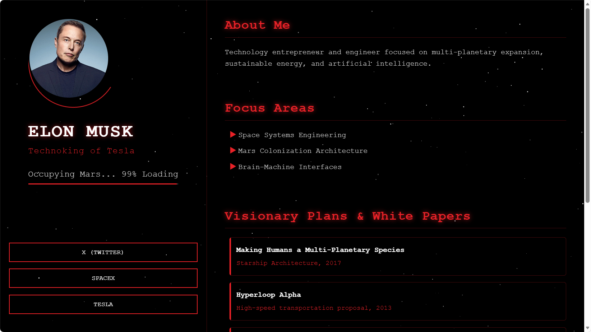

## 6.3 如何部署手工建構的網站

與之前 fork 的模板（來自別人的儲存庫）不同，這個專案是你新建的，還沒有對應的 GitHub 位置。因此我們需要手動綁定。

**第一步：在 GitHub 上建立新儲存庫**

1. 在瀏覽器中登入 GitHub。
2. 點擊右上角的 **+** 圖示，然後選擇 **New repository**。

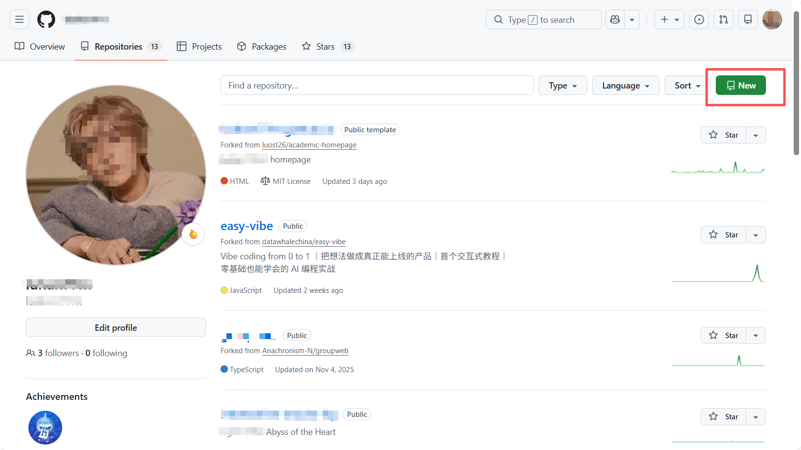

3. **儲存庫名稱**：輸入 `mars-profile` 或任何你喜歡的其他名稱。

**注意**：
如果你已經使用了 **`your-username.github.io`**，就不能在這裡重複使用那個名稱。你可以選擇另一個名稱，GitHub 會生成一個類似 **`your-username.github.io/mars-link`** 的 URL。

4. **Public / Private**：選擇 **Public**。
5. **不要勾選 "Add a README file"！**
   其他選項保持預設。
6. 點擊 **Create repository**。

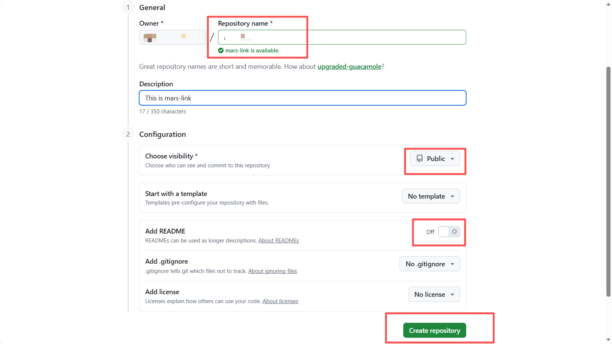

**第二步：將本機程式碼推送到雲端**

建立完成後，GitHub 會帶你到一個有很多程式碼內容的頁面。不用擔心。我們只需要複製該頁面上顯示的儲存庫連結。

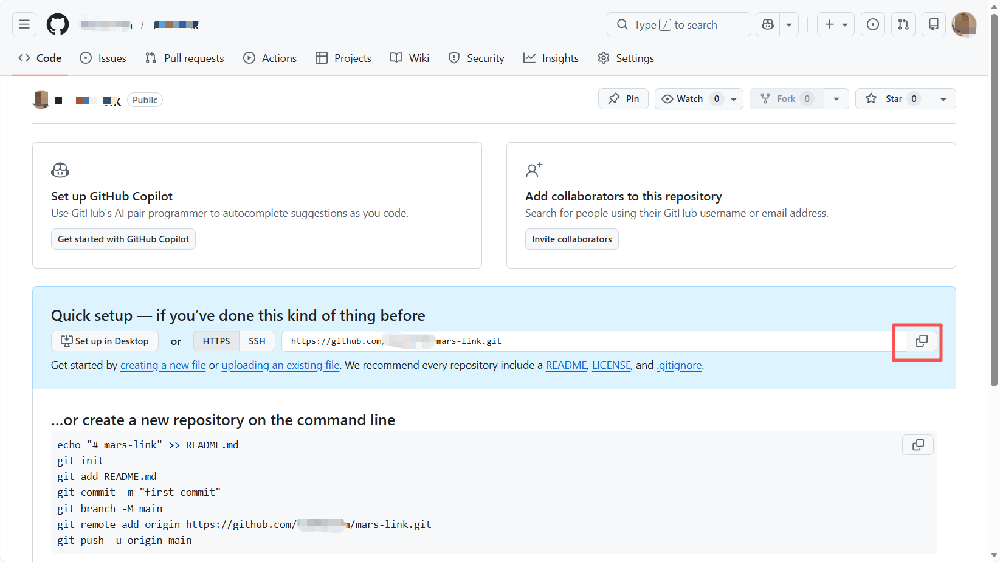

回到 Trae，在聊天中輸入：

```markdown
我在 GitHub 上建立了一個空儲存庫。地址是：https://github.com/your-username/mars-link.git（請替換為你剛才建立的實際儲存庫地址）。
現在請幫我將當前本機專案初始化為 Git 儲存庫，並將程式碼推送到這個遠端地址的 `main` 分支。
```

Trae 通常會幫你執行以下的標準序列，你可能只需要點擊執行：

1. `git init`
2. `git add .` 和 `git commit -m "First commit"`
3. `git branch -M main` 和 `git remote add origin [你的地址]`
4. `git push -u origin main`

Trae 完成推送後，回到 GitHub 重新整理頁面。點擊 **Code** 標籤，你會看到在 Trae 中寫的程式碼已成功推入儲存庫。

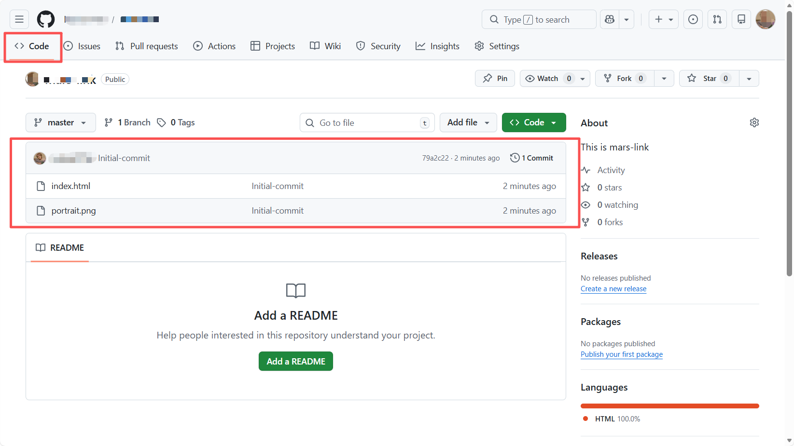

**第三步：啟用 GitHub Pages**

程式碼推送後，網頁不會自動出現。我們還需要手動開啟開關：

1. 回到 GitHub 儲存庫頁面，點擊頂部的 **Settings**。
2. 點擊左側邊欄的 **Pages**。
3. 在 **Build and deployment** 下：
   1. 將 **Source** 設定為 `Deploy from a branch`。
   2. 將 **Branch** 設定為 `main`，並選擇 `/(root)` 作為資料夾。
4. 點擊 **Save**。

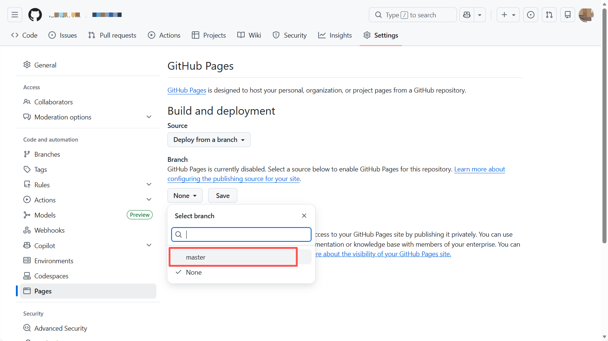

點擊 Save 後，網頁不會立刻出現。GitHub 的後端就像一個小機器人工廠。它需要大約 **1 到 2 分鐘**來打包你的程式碼、建構並發佈到全球伺服器。

耐心等待並重新整理頁面。在 **GitHub Pages** 大標題下，你會看到一行帶有類似以下 URL 的內容：
**"Your site is live at `https://your-username.github.io/mars-link/`"**

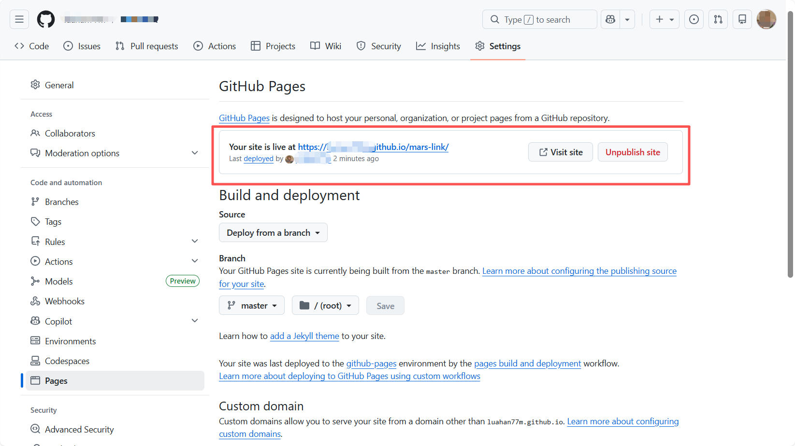

點擊它，你的火星指揮中心就上線了。

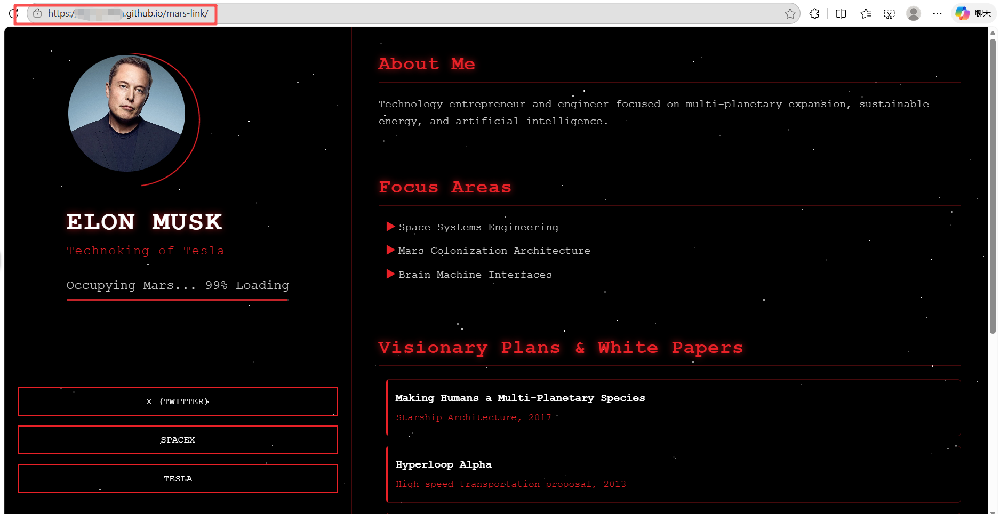

# 7. 結語

教學到此結束。現在，當你看著瀏覽器地址欄中閃耀的 `.github.io`，是不是覺得自己像是在網際網路上插了一面旗幟？

在本教學中，我們借用馬斯克的人設，像搭樂高一樣建構了一個看起來相當厲害的網站。但這只是開始。Vibe Coding 最迷人的部分不是它能節省多少打字時間。而是它**完全打破了「想法」和「現實」之間的牆。**

過去，你可能因為**不會寫 CSS** 而放棄展示一個專案。
現在，剩下的限制只有你的**想像力**和你的**品味**。

**不要讓這個網站停留在「馬斯克風格的仿製品」。**
你用來練習的那個 Tesla 連結和那份火星殖民白皮書，終究是別人的故事。你的主頁應該是你在數位世界中的名片。

去把你的第一個真實專案經驗放在那裡吧。
去發表你對某個技術主題的獨特見解吧。
你甚至可以放上你最喜歡的書單或你自己的照片。
在微信朋友圈會被埋沒的想法，可以在這裡永久保存。
裝不進簡歷的熱情，可以在這裡自由展現。

不要讓這塊地空著。
去實驗。去搞壞它。去重建它。
持續這樣做，直到它長成你最喜歡的樣子。


***去吧，讓世界看見你。***

# 參考資料

CSDN：[2025 最新保姆級教學：一步一步用 GitHub 建構個人主頁](https://blog.csdn.net/qq_45743991/article/details/145505150?ops_request_misc=&request_id=&biz_id=102&utm_term=github%E6%9E%84%E5%BB%BA%E4%B8%AA%E4%BA%BA%E4%B8%BB%E9%A1%B5&utm_medium=distribute.pc_search_result.none-task-blog-2~all~sobaiduweb~default-0-145505150.142^v102^pc_search_result_base4&spm=1018.2226.3001.4187)

CSDN：[Git 下載和安裝教學](https://blog.csdn.net/weixin_41293671/article/details/144255269?ops_request_misc=elastic_search_misc&request_id=63236900b52320a7beb177787ba97f07&biz_id=0&utm_medium=distribute.pc_search_result.none-task-blog-2~all~baidu_landing_v2~default-5-144255269-null-null.142^v102^pc_search_result_base4&utm_term=git%E4%B8%8B%E8%BD%BD%E5%AE%89%E8%A3%85&spm=1018.2226.3001.4187)

CSDN：[Windows 下 Ruby 安裝教學](https://blog.csdn.net/alive_tree/article/details/103043158?ops_request_misc=elastic_search_misc&request_id=ad7e29ea7f702554d785c2fc82ec6e95&biz_id=0&utm_medium=distribute.pc_search_result.none-task-blog-2~all~ElasticSearch~search_v2-11-103043158-null-null.142^v102^pc_search_result_base4&utm_term=ruby%E5%AE%89%E8%A3%85%E6%95%99%E7%A8%8B&spm=1018.2226.3001.4187)
